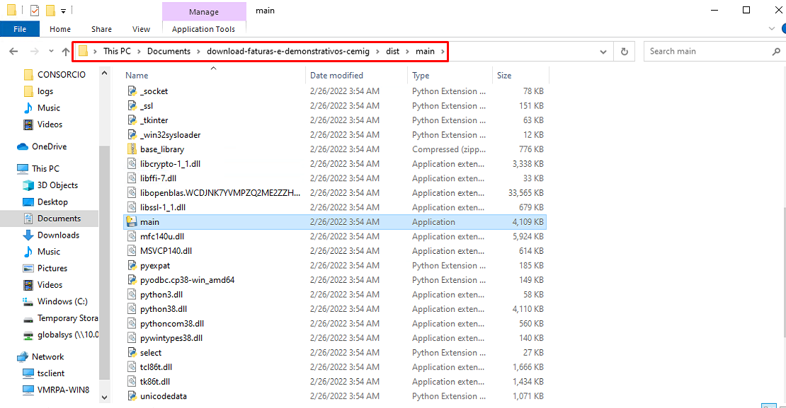
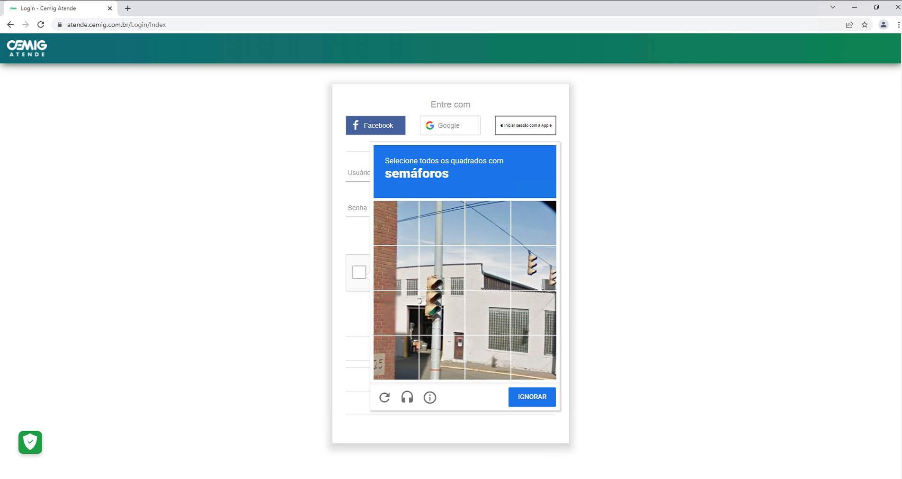
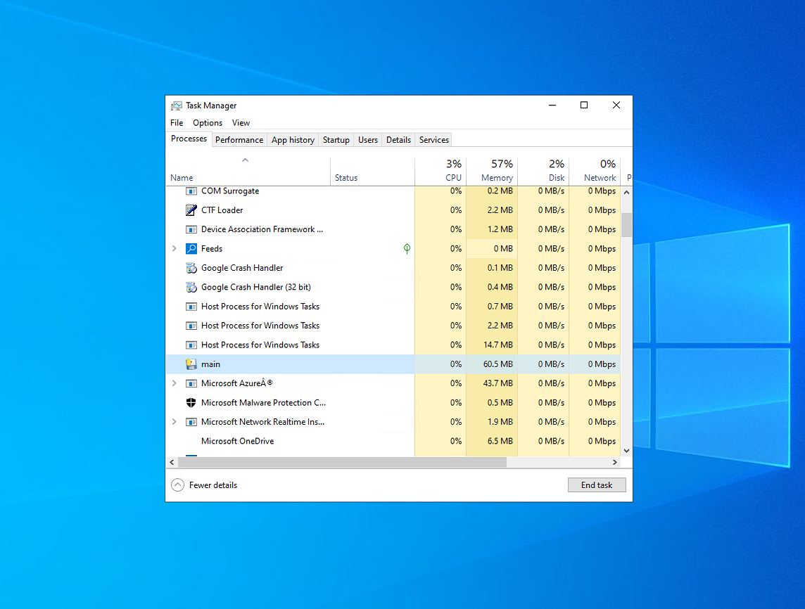

# INTRODUÇÃO

O projeto **DOWNLOAD DAS FATURAS E DEMONSTRATIVOS DA CEMIG** consiste em realizar o _download_ das faturas e demonstrativos 
para os medidores da empresa no portal da CEMIG que se encontra no [Link portal CEMIG](https://atende.cemig.com.br/Login)

As _Usinas Geradoras_ possuem um número do medidor associado, e apartir dele é feito os downloads dos documentos. 


# REQUISITOS

Abaixo, exemplificou-se a forma como os arquivos devem ser baixados e nomeados:

| Nº medidor | Usina/Assinante |  Coop/Cons  |
|:----------:|:---------------:|:-----------:|
|  02020200  |      Usina      | Cooperativa |
|  03030303  |      Usina      |  Consórcio  |
|  04404040  |   Instalações   | Cooperativa |
|  05050500  |   Instalações   |  Consórcio  |

Nome dos arquivos de saída:

* Demonstrativo_Usina_Cooperativa_02020200_2021_06_20
* Demonstrativo_Usina_Consórcio_03030303_2021_06_20
* Fatura_Usina_Cooperativa_02020200_2021_06_20
* Fatura_Usina_Consórcio_03030303_2021_06_20
* Fatura_Instalações_Consórcio_05050500_2021_06_20
* Fatura_Instalações_Cooperativa_04404040_2021_06_20


## PROCESSOS

Os processos foram dividios conforme o agrupamento lógico das etapas. Eles se encotram no arquivo [.yml](.config.yml).
Pode-se comentar os processos que não são necessários para rodada. \
Visualização dos processos no arquivo:

```yaml
# NUNCA COMENTAR O TÍTULO DO PROCESSO, A LINHA LOGO A BAIXO.
processos:

#    - Processo comentado exemplo
    - Downloads das faturas
    - Downloads dos demonstrativos
    - Conversao xml

login_realizado: Não
#login_realizado: Sim
```

Os processos deste projeto foram dividios em:

  * **Downloads das faturas**: O site da CEMIG tem uma seção chamada _Consultar Débitos_, no qual são feito os downloads dos arquivos
    no formato **PDF**.
  * **Downloads dos demonstrativos**: O site da CEMIG tem uma seção chamada _Mini / Micro Geração Distribuída_, no qual são feito os
    download dos arquivos no formato **XLSX** ou no formato **ZIP**. Quando feito o download do arquivo no formato **ZIP**,
    e feita também a extração dos arquivos, que devem estar no formato **XML**.
  * **Conversao XML**: Quando houver arquivos no formato **XML**, converte para **CSV**.


## ETAPAS PARA EXECUTAR O ROBÔ

  * Etapa 1 — Executando o projeto. Para executar o projeto, basta ir na pasta [dist/main](dist/main) na raíz do projeto,
    e executar o arquivo [main.exe](dist/main/main.exe).
      


  * Etapa 2 — Verificando se o login foi realizado. Ao entrar no site, o robô verifica se o login já foi feito. Se sim, ele 
    continua o processo normalmente, se não, ele tenta logar. Se houver problema na hora de logar, existem duas formas de resolver.
    A primeira é entrando manualmente no site e deixando a seção aberta. Para isso deve-se descomentar a opção `login_realizado: Sim`
    e comentar a opção `login_realizado: Não` no arquivo [config.yml](.config.yml), conforme mostrado a baixo:

    ```yaml
    # NUNCA COMENTAR O TÍTULO DO PROCESSO, A LINHA LOGO A BAIXO.
    processos:
 
    #    - Processo comentado exemplo
        - Downloads das faturas
        - Downloads dos demonstrativos
        - Conversao xml
  
    #login_realizado: Não
    login_realizado: Sim
    ```
    A segunda opção seria, ao tentar entrar no site, o robô vai ter problemas se o captcha aparecer. O que pode ser feito é
    simplesmente resolver o captcha na mão e clicando no botão de `Entrar`. O robô é inteligente para esperar o login ser realizado,
    por isso não é necessário agilidade nessa parte.
    
    

## MÉTRICAS DE ACOMPANHAMENTO DO ROBÔ

Foi criado um banco de dados para esse projeto com as sequintes tabelas:

* Projetos
* Robos
* Processos
* Rodadas
* Logs
* Outputs

Na tabela `Projetos`, encontra-se informações sobre o projeto que foi automatizado. A tabela `Robos` contem os robôs de cada
projeto e algumas informações do robô. A tabela `Processos` contem informações dos processos de cada robô, no caso deste projeto
os processos fazem referência aos listados no arquivo [.yml](.config.yml):

```yaml
processos:
    - Downloads das faturas
    - Downloads dos demonstrativos
    - Conversao xml
  
    ...  
```

Cada vez que o robô é acionado, é criado um registro da rodada na tabela `Rodadas` para cada processo ativo (lembrando que 
os processos de cada robo estão na tabela `Processos`). Para cada medidor que se encontra na tabela `view_instalacoes_cemig`
do banco de dados da empresa, será criado um registro na tabela `Logs` com `status` igual à 0, igualmente é feito um registro 
na tabela `Outputs` com informações mais detalhadas dos arquivos que serão processados. A medida que os medidores forem sendo
processados, os stauts dos registros nas tabelas `Logs` e `Outputs` vão sendo atualizados. A baixo, os valores dos status 
na tabela `Logs` e seus significados:

* 0: Não processado
* 1: Processado
* 2: Sem arquivos
* 3: Medidor sem contrato
* 4: Site indisponível

Na tabela `Outputs`, os únicos valores de status são 0 e 1, não processado e processado respectivamente. Quando o valor da
coluna status for igual à 1 e o valor da coluna codigo for _null_, quer dizer que o medidor foi processado mas não tinha 
arquivo para ser baixado.

## CONSIDERAÇÕES 
  * O robô salva os arquivos na pasta da rede `Z:\producao\storage\app\public\arquivos\rpa`, adicionando os diretórios do dia da rodada.
  Então, se a data atual da rodada for 25/01/2022, ele irá salvar os arquivos em `Z:\producao\storage\app\public\arquivos\rpa\2022\01\25`.  \
  Ele também salva os arquivos no projeto na pasta `documents/downloads`, com o mesmo padrão de diretórios de data.
  * Se for necessário parar o robô, deve-se abrir o `Gerenciador de tarefas` e finalizar o processo chamado de **main.exe**. 
  
